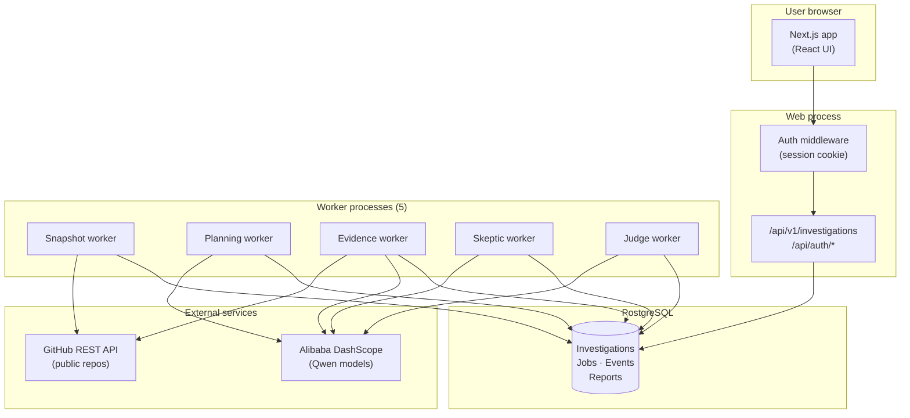
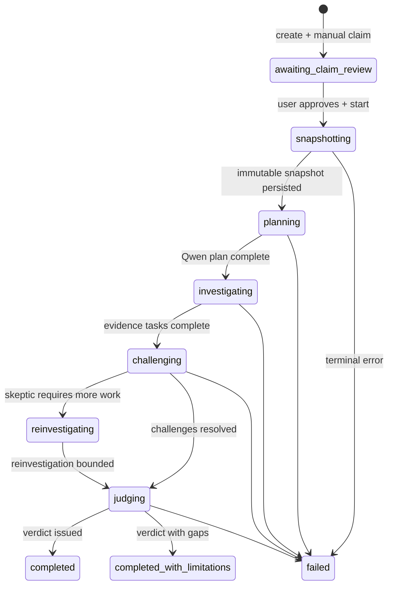

# Cernix architecture

Cernix is an evidence-driven investigation platform for public GitHub repositories. A user defines one verifiable claim, approves it, and durable workers orchestrate snapshotting, planning, evidence retrieval, skeptic review, and final judgment. The web app reads PostgreSQL state; workers advance lifecycle stages asynchronously.

## System overview

## Investigation lifecycle

## Multi-agent pipeline

Each stage maps to a durable worker and a Qwen-backed role where reasoning is required:

| Stage | Worker | Role | Primary input |
| --- | --- | --- | --- |
| `snapshotting` | Snapshot | Repository ingest | GitHub tree + blob APIs |
| `planning` | Planning | Investigation planner | Claim + snapshot manifest |
| `investigating` | Evidence | Repository investigator | Admitted file excerpts only |
| `challenging` | Skeptic | Adversarial reviewer | Provisional evidence bundle |
| `judging` | Judge | Evidence judge | Challenges + evidence + limitations |

Human-in-the-loop happens **before** automation: the user reviews and approves the claim statement on the claims screen.

## Durable job model

PostgreSQL is the queue and source of truth. Each worker:

1. Claims one eligible job with `FOR UPDATE SKIP LOCKED`
2. Records a lease token and attempt history
3. Performs work outside the claim transaction
4. Heartbeats while running; expired leases can be reclaimed safely
5. Commits lifecycle transitions atomically with job success or failure

Snapshot identity is immutable per investigation. A replacement worker replays an existing snapshot instead of rebuilding from GitHub when one is already persisted.

## Authentication and ownership

- GitHub OAuth establishes a server-side session (HTTP-only cookie)
- Every investigation row has `owner_user_id`
- API routes enforce owner scope; cross-user ID access returns `not_found`
- Mutations require an `Idempotency-Key` header (UUID)

## Alibaba Cloud / Qwen integration

Model calls go through DashScope-compatible chat completions. The client lives at `server/qwen/client.ts` and is used by planning, evidence, skeptic, and judge services. Configure:

- `QWEN_API_KEY`
- `QWEN_API_ORIGIN` (e.g. `https://dashscope-intl.aliyuncs.com` for international)

Deployment target for the hackathon is Alibaba Cloud (ECS + RDS). The application code is cloud-agnostic; only hosting and managed PostgreSQL are Alibaba-specific.

## Frontend data flow

The UI does **not** simulate investigations. UUID-backed routes call `/api/v1/investigations/*` with credentials. The live screen polls lifecycle events every two seconds. The report screen loads the durable judge artifact after terminal completion.

`/sample-report` is a **static illustrative report** only. It does not reflect a live backend investigation.

## Key directories

| Path | Purpose |
| --- | --- |
| `app/` | Next.js routes and UI |
| `server/persistence/` | Investigation and snapshot repositories |
| `server/worker/` | Durable worker runners and job repositories |
| `server/qwen/` | DashScope client and agent services |
| `server/github/` | Immutable public snapshot ingest |
| `server/auth/` | OAuth, sessions, ownership |
| `lib/contracts/` | Shared API and domain schemas |
